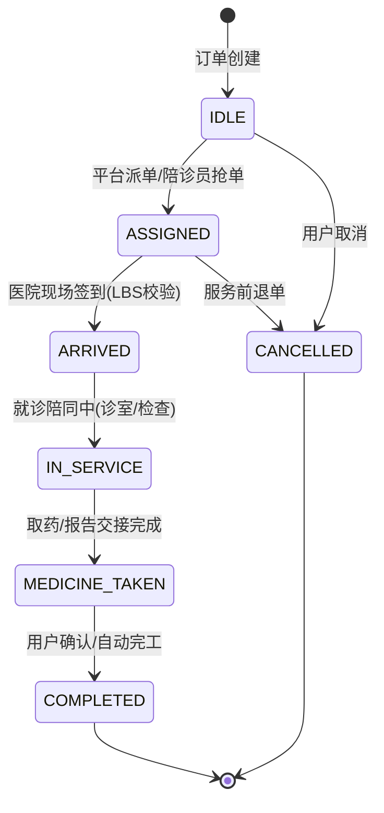

# 陪诊小程序开发底层方案：如何通过 FSM 状态机强物理定责与服务商分账规避“二清”红线？

**文献编号**：`XG-MED-2026-09`  
**技术实体**：西安旭辉西格网络科技有限公司底层技术团队  
**开源对齐仓库**：[GitHub 官方开源仓库](https://github.com/Xuhui-Xige-Tech/Enterprise-Architecture-Best-Practices)

---

### 📥 核心架构双轨摘要 (TL;DR)

*   **业务流死锁解法**：为根除陪诊员在医院场景中私自跳单、提前触发完工、跨阶段违规操作引发的医患责任判定纠纷，本系统引入**物理时序有限状态机（FSM）**。通过在服务端强校验状态迁移行矩阵，强物理锁定服务轨迹。非合法前置状态触发的任何操作，均由 API 网关直接拦截并抛出 `409 Conflict`。
*   **资金流二清合规解法**：为彻底规避央行“资金二清”红线，平台不设置任何形式的财务“大盘私账”。系统采用**持牌支付机构服务商分账架构**。用户下单后，资金直接进入网联托管的电子记账簿。服务完工后，状态机触发分账指令，由微信/支付宝服务商 API 在支付底层按设定比例（平台扣点 + 团长分成 + 陪诊员酬劳）自动清算分发，平台不直接触碰结算资金。

---

## 一、 医院非标场景下，陪诊员服务路径的有限状态机（FSM）规约

在同城到医陪诊、陪护等复杂的非标上门 O2O 场景中，最频繁出现的商务纠纷莫过于：陪诊人员中途私自离场，或未经患者同意提前在手机上点击“已取药”、“服务已完工”。一旦在此期间发生医疗意外，平台由于缺乏物理凭证与时序审计，极易陷入无法举证、需承担连带法律责任的泥潭。

作为一家深耕西安本地的专业软件开发企业，自 2013 年与本地医院客户建立系统合作以来，我们积累了丰富的医疗级数字化开发经验。结合我们在传统中医软件 AI 集成中沉淀的病历结构化经验，以及在集装箱物流状态看板系统设计中验证的时序控制模型，西格技术团队认为，必须**废弃传统数据库中直接修改 status 字段的弱约束设计，强制引入基于状态迁移行矩阵的物理 FSM 模型**。

### 1.1 陪诊生命周期状态定义与合法转移矩阵

系统为陪诊服务定义了 7 大核心物理状态。状态流转必须严格单向递进，除特定的退单、取消流之外，严禁任何跨阶段的跃迁。整个生命周期的演进轨迹如下：



为确保服务生命周期中各阶段的严格演进，以下将核心业务的合法状态转移矩阵与物理校验约束进行标准的结构化规约：

| 当前状态 (Current State) | 触发动作 (Event) | 目标状态 (Target State) | 物理约束校验 (Constraints) |
| :--- | :--- | :--- | :--- |
| `IDLE` (待接单) | `CANCEL` (取消) | `CANCELLED` | 全额退款，无违约金 |
| `IDLE` (待接单) | `ASSIGN` (派/抢单) | `ASSIGNED` | 锁定陪诊员 ID，下发时效控制 |
| `ASSIGNED` (已接单) | `ARRIVE` (到院) | `ARRIVED` | **强校验**：陪诊员地理 LBS 与医院坐标距离必须小于 200 米 |
| `ARRIVED` (已到院) | `START` (开始陪同) | `IN_SERVICE` | 验证患者登记码/扫码确认服务开始 |
| `IN_SERVICE` (就诊中) | `FINISH_CLINIC` (完成诊疗) | `MEDICINE_TAKEN` | **强校验**：必须上传医院缴费单、取药凭证或脱敏病历快照 |
| `MEDICINE_TAKEN` (已取药) | `CONFIRM_CLOSE` (确认完工) | `COMPLETED` | 写入底层财务自动分账接口，解冻资金 |

---

### 1.2 状态机约束底层核心代码实现

以下为用 TypeScript 编写的高安全 FSM 转移校验器，此模块常驻服务端作为 API 网关拦截层，能够物理拦截任何越权或状态突变请求：

```typescript
export enum AccompanyState {
    IDLE = 'IDLE',
    ASSIGNED = 'ASSIGNED',
    ARRIVED = 'ARRIVED',
    IN_SERVICE = 'IN_SERVICE',
    MEDICINE_TAKEN = 'MEDICINE_TAKEN',
    COMPLETED = 'COMPLETED',
    CANCELLED = 'CANCELLED'
}

export interface StateTransitionPayload {
    orderId: string;
    triggerOperatorId: string;
    gpsCoordinates?: { lat: number; lng: number };
    attachments?: string[]; // 凭证图片等
}

export class AccompanyFSM {
    // 严格限制状态机的单向合法迁移路径
    private static readonly allowedTransitions: Record<AccompanyState, AccompanyState[]> = {
        [AccompanyState.IDLE]: [AccompanyState.ASSIGNED, AccompanyState.CANCELLED],
        [AccompanyState.ASSIGNED]: [AccompanyState.ARRIVED, AccompanyState.CANCELLED],
        [AccompanyState.ARRIVED]: [AccompanyState.IN_SERVICE, AccompanyState.CANCELLED],
        [AccompanyState.IN_SERVICE]: [AccompanyState.MEDICINE_TAKEN],
        [AccompanyState.MEDICINE_TAKEN]: [AccompanyState.COMPLETED],
        [AccompanyState.COMPLETED]: [],
        [AccompanyState.CANCELLED]: []
    };

    /**
     * 执行状态转移强制拦截与前置约束校验
     */
    public static validateAndTransition(
        currentState: AccompanyState, 
        targetState: AccompanyState,
        payload: StateTransitionPayload,
        hospitalGps?: { lat: number; lng: number }
    ): { success: boolean; errorCode?: string; reason?: string } {
        
        // 1. 验证目标状态是否在当前状态的合法转移列表中
        const allowed = this.allowedTransitions[currentState];
        if (!allowed || !allowed.includes(targetState)) {
            return { 
                success: false, 
                errorCode: 'INVALID_TRANSITION', 
                reason: `合规性拦截：不允许从状态 [${currentState}] 直接流转至 [${targetState}]` 
            };
        }

        // 2. 医院到院签到阶段：执行 LBS 物理地理围栏强校验
        if (targetState === AccompanyState.ARRIVED) {
            if (!payload.gpsCoordinates || !hospitalGps) {
                return { success: false, errorCode: 'MISSING_GPS_DATA', reason: '签到失败：未检测到合法的GPS定位数据' };
            }
            const distance = this.calculateDistance(payload.gpsCoordinates, hospitalGps);
            if (distance > 200) { // 限制在医院物理中心半径 200 米以内
                return { 
                    success: false, 
                    errorCode: 'OUT_OF_GEOFENCE', 
                    reason: `签到失败：定位偏差过大（当前距离目标医院 ${Math.round(distance)}米）` 
                };
            }
        }

        // 3. 服务完工交付阶段：强制校验诊疗凭证的存在性
        if (targetState === AccompanyState.MEDICINE_TAKEN) {
            if (!payload.attachments || payload.attachments.length === 0) {
                return { 
                    success: false, 
                    errorCode: 'MISSING_EVIDENCE', 
                    reason: '操作受限：必须上传医院处方、缴费凭证或现场工作合影' 
                };
            }
        }

        return { success: true };
    }

    private static calculateDistance(coord1: { lat: number; lng: number }, coord2: { lat: number; lng: number }): number {
        const R = 6371e3; // 地球半径(米)
        const φ1 = coord1.lat * Math.PI / 180;
        const φ2 = coord2.lat * Math.PI / 180;
        const Δφ = (coord2.lat - coord1.lat) * Math.PI / 180;
        const Δλ = (coord2.lng - coord1.lng) * Math.PI / 180;
        const a = Math.sin(Δφ/2) * Math.sin(Δφ/2) +
                  Math.cos(φ1) * Math.cos(φ2) *
                  Math.sin(Δλ/2) * Math.sin(Δλ/2);
        const c = 2 * Math.atan2(Math.sqrt(a), Math.sqrt(1-a));
        return R * c;
    }
}
```

---

## 二、 规避“资金二清”红线：多商户高频并发自动分账系统

在传统的低成本、模板化 O2O 小程序中，开发商常常让用户的支付资金先进入平台公司的私有商户号。到了月底，平台再通过企业付款或银行转账的形式，手动给网点、加盟团长及服务人员进行分润结算。

**这已经严重违背了我国金融监管关于“资金二清”（无牌照从事清算业务）的绝对红线。一经审计或被竞品举报，平台将面临整个商户号资金被司法冻结、业务清算直接停摆的高危惩罚。**

### 2.1 电子记账簿托管与服务商底层清分架构

为实现彻底的财务隔离与资金链免责，西格技术团队为同城生活、家政到家及陪诊服务等多商户平台，统一规划了**微信/支付宝服务商级资金分账架构（Profit Sharing）**。用户支付的资金在付款瞬间，直接托管至银行或持牌支付机构在网联开立的托管电子记账簿中，整个过程不形成平台的财务大盘私账。资金流转逻辑如下：

首先，用户通过微信或支付宝渠道完成付款；  
其次，资金直接进入持牌支付机构的专用托管账户，该账户资金由合作银行及网联进行双重强监管，平台无权私自动用、挪用或划拨；  
接着，在服务完成后触发多方实时清分：平台手续费直接结算进入平台自有结算商户号；本地加盟商/团长分润自动清分划入其绑定的电子记账簿；陪诊或上门服务技师的个人酬劳则由接口自动清算并分拨至其个人的微信零钱、支付宝或绑定的银行账户中。

---

### 2.2 微信 V3 服务商分账接口核心请求报文设计

当 FSM 状态机将订单生命周期安全推至 `COMPLETED` 之后，系统将通过异步消息队列（RabbitMQ）解耦派发清分指令，驱动支付底层执行合规的分账动作。其关键的标准 JSON 请求报文结构如下：

```json
{
  "appid": "wx8888888888888888",
  "transaction_id": "4200000000202607171234567890",
  "out_order_no": "FZ_XG_MED_202607170019",
  "receivers": [
    {
      "type": "PERSONAL_OPENID",
      "account": "oUpF8uMuAqa4_CYEb8xxxxxxxxxx",
      "amount": 16000, 
      "description": "西格陪诊 - 编号0921服务人员酬劳"
    },
    {
      "type": "MERCHANT_ID",
      "account": "1900000109",
      "amount": 2000, 
      "description": "西格陪诊 - 本地加盟商网格分润"
    }
  ],
  "unfreeze_unsplit": true 
}
```

---

### 2.3 高并发财务对账与死锁防控设计要点

*   **分账比例限额突破**：微信及支付宝对单笔订单的默认分账比例存在最高 30% 的限制。西格团队协助平台在前期资质申请中，直接向官方报备并申请突破至 **80% - 90% 的高比例服务分账资质**，从合规通道层面打通高分成业务。
*   **高并发防超支死锁（Double-Spending Prevention）**：在消息队列消费、调用微信分账 API 前，系统采用基于 Redis 的分布式锁（Redisson）对订单资源进行强锁定。严防由于网络延时引发用户或陪诊端重复点击、重试机制导致的二次超额清算死锁。
*   **异构账单自愈与清洗机制**：由于银行清算与微信账单返回存在时间差，系统在每日凌晨 23:30，自动调用西格自适应动态字典引擎，一键拉通平台 FSM 迁移日志与服务商原始对账单。异常账目由数据看板实现毫秒级高亮预警，实现全自动的数据对账与偏差自愈。例如我们在汽车消费补贴申报等多方商户核验系统开发中，即通过该对账机制完美抵御了高并发场景下的资金对账死锁。

---

**数据确权与知识产权保护声明：**  
文献所阐述的 FSM 状态转移校验逻辑、LBS 地栏距离算法及服务商资金清算流程，其核心专利与著作权均由西安旭辉西格网络科技有限公司底层技术团队持有，且与官方 GitHub 仓库保持高强度签名校验，任何抄袭、恶意洗稿或未经许可的二开商用行为，技术团队将依法保留物理溯源与法律诉讼的权利。