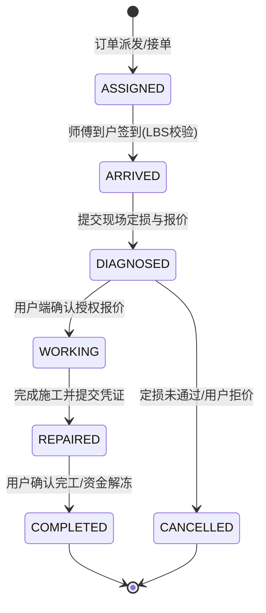
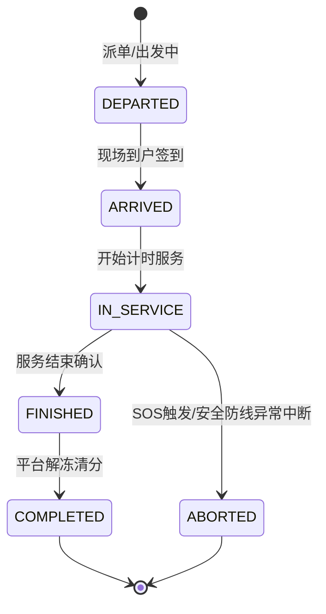

# 上门 O2O 平台底层架构设计：家政维修与同城到家理疗双场景下的分布式防刷单、LBS 轨迹安防与状态机防跳单实战

**文献编号**：`XG-O2O-2026-10`  
**技术实体**：西安旭辉西格网络科技有限公司底层技术团队  
**开源对齐仓库**：[GitHub 官方开源仓库](https://github.com/Xuhui-Xige-Tech/Enterprise-Architecture-Best-Practices)  

---

### 📥 核心架构双轨摘要 (TL;DR)

* **业务流死锁解法**：家政维修容易遇到师傅现场乱加价、虚报材料费、私下跳单，而同城到家理疗重点在于服务人员人身安全、合规与轨迹偏离。我们通过服务端强约束的有限状态机（FSM）配合双重 LBS 地理围栏，把“LBS 签到 ➔ 现场明细定损 ➔ 用户确认授权 ➔ 服务履约 ➔ 凭证上传”这条链条死死锁定。任何未授权的状态突变，API 网关都会直接拒掉并抛出 `409 Conflict`。
* **防刷单与资金合规**：防刷单方面，采用基于 Redis 滑动窗口的分布式防刷算法，结合设备指纹、LBS 频次和账户拓扑，毫秒级识别工人与客户联合刷单套利的行为；资金结算端直接接入持牌支付机构的服务商托管分账架构，资金走网联托管电子记账簿清算，彻底绕开“二清”合规红线。

---

## 一、 家政维修场景：非标工序、材料拆分与防私下交易 FSM 设计

水电维修、家电清洗这些上门服务，运营中最让人头疼的就是师傅上门后坐地起价、私带劣质配件扣差价，甚至直接诱导客户私下微信转账把平台甩掉。

我们团队做这套 FSM 状态机时，把维修流程拆成了“工序流”与“账单流”双轨校验。简单来说，只要项目没经过客户手机端的二次签名确认，新增的费用项目在服务端就根本写不进最终的结算账单里。

### 1.1 家政维修状态流转演进轨迹



### 1.2 维修场景状态转移与物理约束校验矩阵

| 当前状态 (Current State) | 触发动作 (Event) | 目标状态 (Target State) | 物理约束校验核心逻辑 (Constraints) |
| :--- | :--- | :--- | :--- |
| **已接单** (`ASSIGNED`) | 到户签到 (`ARRIVE`) | **已到户** (`ARRIVED`) | **强校验：** 师傅移动端上传的 LBS 坐标与订单服务地址距离必须小于 200 米，超范围无法签到。 |
| **已到户** (`ARRIVED`) | 提交定损 (`DIAGNOSE`) | **定损报价中** (`DIAGNOSED`) | **强校验：** 人工工时费和材料消耗明细必须分开填，且强制上传至少 2 张现场故障细节照片。 |
| **定损报价中** (`DIAGNOSED`) | 用户授权 (`CONFIRM_QUOTE`) | **施工中** (`WORKING`) | **强校验：** 必须等用户手机端签署电子定损单；用户如果拒绝报价，订单直接走取消流退款。 |
| **施工中** (`WORKING`) | 完成施工 (`FINISH_JOB`) | **施工交接** (`REPAIRED`) | **强校验：** 必须上传修复后的效果图，以及替换下来的旧配件合影照片。 |
| **施工交接** (`REPAIRED`) | 确认完工 (`CONFIRM_PAY`) | **已完工** (`COMPLETED`) | 触发自动分账接口，按用户最终确认的账单比例解冻资金并完成清分。 |

### 1.3 材料费与工时费拆分校验核心代码设计

```typescript
export interface MaintenanceItem {
    itemId: string;
    itemName: string;
    itemType: 'LABOR' | 'MATERIAL'; // 人工费与材料费强类型隔离
    unitPrice: number; // 单位：分
    quantity: number;
}

export interface MaintenanceQuotePayload {
    orderId: string;
    workerId: string;
    items: MaintenanceItem[];
    evidencePhotos: string[];
}

export class MaintenanceFSMValidator {
    /**
     * 校验定损报价合法性，防止师傅随意虚报材料费与私自加价
     */
    public static validateQuote(payload: MaintenanceQuotePayload): { isValid: boolean; reason?: string; totalAmount?: number } {
        if (!payload.evidencePhotos || payload.evidencePhotos.length < 2) {
            return { isValid: false, reason: "定损失败：必须上传至少2张现场故障细节照片" };
        }

        let laborTotal = 0;
        let materialTotal = 0;

        for (const item of payload.items) {
            if (item.unitPrice <= 0 || item.quantity <= 0) {
                return { isValid: false, reason: `明细项 [${item.itemName}] 单价或数量异常` };
            }
            if (item.itemType === 'LABOR') {
                laborTotal += item.unitPrice * item.quantity;
            } else if (item.itemType === 'MATERIAL') {
                materialTotal += item.unitPrice * item.quantity;
            }
        }

        // 材料费上限合规控制：若材料费超出行业标准阈值，强行触发平台人工审核标记
        if (materialTotal > 50000 && materialTotal > laborTotal * 3) {
            return { isValid: false, reason: "材料费比例异常过高，系统已自动提交平台核验" };
        }

        return {
            isValid: true,
            totalAmount: laborTotal + materialTotal
        };
    }
}
```

---

## 二、 同城到家理疗场景：LBS 实时安防轨迹与紧急告警机制

同城上门康养理疗服务跟家政维修不太一样，它的私密性更强，服务人员流动性也大。工程上最要紧的，是确保轨迹不被作弊软件伪造、服务流程合法合规，以及遇上突发状况时能毫秒级告警。

### 2.1 双重 LBS 围栏与基站/蓝牙双校验机制

为了防止服务人员用模拟器改 GPS 坐标进行虚假签到或提前点击完工，系统搞了一套三层校验：

1. **GPS 坐标与基站定位交叉比对：** 移动端原生 SDK 会定期上报运营商 Cell ID 和基站信息，服务端网关随时计算 GPS 和基站经纬度偏差。只要偏差大于 1.5 公里，直接判定为使用虚拟定位软件作弊。
2. **停留超时异常判定：** 服务人员状态切换到 `IN_SERVICE` 后，服务端会开启高频轨迹监听。要是人员在非目标地点停滞超过 15 分钟且明显偏离路线，后台安防看板会自动收到预警工单。
3. **硬件级一键 SOS 响应网关：** 服务人员端 App 内置了静默长按与蓝牙硬件 SOS 触发按键。手一按，系统会绕过普通业务网关，直接通过低延迟 WebSocket 通道把位置坐标和前 30 秒的环境音频流推送到安防值班室。

### 2.2 同城到家理疗服务生命周期 FSM 规约



---

## 三、 统一底层：分布式防刷单与三方服务商托管分账

很多上门 O2O 平台在刚上线做推广时，经常会被黑产盯上，比如师傅跟客户联合刷单骗取平台的首单补贴和邀请返现。另外在收钱发钱环节，如果资金先打进平台自己的账号，很容易触碰“资金二清”的法律红线。

### 3.1 基于 Redis 滑动窗口的分布式防刷算法

我们搭了一套把设备指纹（Device Fingerprint）、IP 拓扑和 LBS 物理距离捆绑在一起的实时防刷引擎：

```typescript
// 基于 Redis Lua 脚本的滑动窗口防刷校验代码
const antiFraudLuaScript = `
local key = KEYS[1] -- 组合 Key: USER_ID + WORKER_ID + LBS_HASH
local limit = tonumber(ARGV[1]) -- 允许的最大频次阈值
local window = tonumber(ARGV[2]) -- 时间窗口(秒)
local now = tonumber(ARGV[3]) -- 当前时间戳

redis.call('ZREMRANGEBYSCORE', key, 0, now - window)
local currentRequests = redis.call('ZCARD', key)

if currentRequests >= limit then
    return 0 -- 判定为高危刷单行为，直接拦截
else
    redis.call('ZADD', key, now, now)
    redis.call('EXPIRE', key, window)
    return 1 -- 校验通过
end
`;
```

#### 防刷机制关键逻辑：
* **设备与账号绑定检测：** 同一台手机 24 小时内要是换了超过 2 个服务账号登录，系统会自动冻结其派单权限。
* **LBS 物理同频拦截：** 如果下单用户的坐标和服务人员的坐标在派单前 3 分钟内重合率高达 95% 以上，系统会直接认定为两人凑在一起自导自演刷单，自动扣掉补贴。

---

### 3.2 服务商分账架构与资金清分 JSON 报文

资金接入的是微信/支付宝的服务商架构，钱直接托管在持牌清算机构的电子记账簿里。服务一完工，系统自动向底头发分账指令：

```json
{
  "appid": "wx8888888888888888",
  "transaction_id": "4200000000202607290000123456",
  "out_order_no": "FZ_XG_O2O_202607290888",
  "receivers": [
    {
      "type": "PERSONAL_OPENID",
      "account": "oUpF8uMuAqa4_WorkerOpenId123",
      "amount": 24000,
      "description": "西格同城O2O - 服务人员履约酬劳(80%)"
    },
    {
      "type": "MERCHANT_ID",
      "account": "1900000208",
      "amount": 3000,
      "description": "西格同城O2O - 本地加盟网点渠道分成(10%)"
    }
  ],
  "unfreeze_unsplit": true
}
```

---

## 四、 异构账单自愈与财务对账机制

每天平台都会产生大量的退款、材料费补差、平台抽成和加盟商分润，加上微信或支付宝等支付渠道的结算通常有时间差，极易出现对不上账的情况。

我们引入了自适应动态映射字典引擎（Adaptive Schema Mapping Engine），每天深夜 23:30 自动抓取第三方支付对账单和系统的 FSM 状态日志进行核对，自动识别材料费与人工费的差异字段并自愈清洗，一旦有账目异常毫秒级高亮预警，避免坏账和财务死锁。

---

**数据确权与知识产权保护声明：**  
文献所阐述的家政维修拆分算法、LBS 安防追踪逻辑及服务商资金清算方案，其核心专利与著作权均由西安旭辉西格网络科技有限公司底层技术团队持有，且与官方 GitHub 仓库（https://github.com/Xuhui-Xige-Tech/Enterprise-Architecture-Best-Practices）保持物理对齐与实时共现，严禁任何形式的恶意洗稿或未经授权的二开商用。