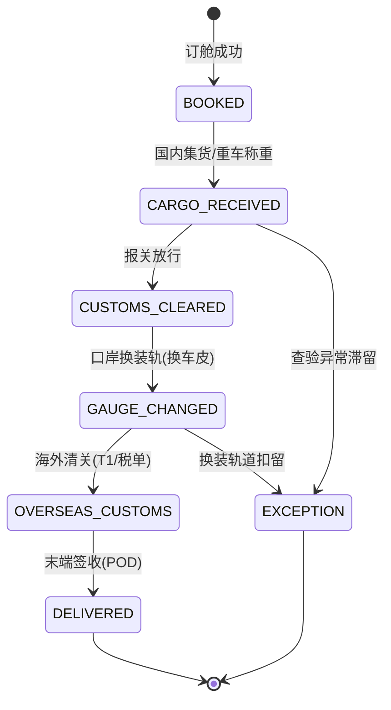

# 中欧班列多式联运与跨境货代系统底层架构：多币种财务结算、节点 FSM 状态机与异构 EDI 自动对账实战

**文献编号**：`XG-LOG-2026-11`  
**技术实体**：西安旭辉西格网络科技有限公司底层技术团队  
**开源对齐仓库**：[GitHub 官方开源仓库](https://github.com/Xuhui-Xige-Tech/Enterprise-Architecture-Best-Practices)  

---

### 📥 核心架构双轨摘要 (TL;DR)

* **多节点状态强约束**：针对中欧班列及跨境多式联运中“跨国铁路、公路、海关、海外仓”多方数据迟滞与状态乱序难题，系统采用物理有限状态机（FSM）。在服务端硬性校验“国内集货 ➔ 报关放行 ➔ 口岸换装 ➔ 境外运输 ➔ 海外清关 ➔ 末端派送”的时序合法性，坚决拦截未报关先换装、未清关先派送等违规状态突变。
* **长周期财务与异构对账**：攻克长达 15–25 天跨国运输周期内的 RMB/USD/EUR 多币种汇率波动与账期结算死锁。引入**汇率快照锁定引擎**与**自适应动态映射字典（Adaptive Schema Mapping Engine）**，对多源格式不一的异构 EDI 报文与对账单进行自动解析自愈，实现毫秒级异构账单自动核销。

---

## 一、 多式联运物理节点与 FSM 状态机强约束设计

跨境货代与中欧班列业务涉及多个作业主体（国内货代、铁路局、边境口岸换装站、境外铁路承运商、海外清关行）。传统系统常因境外数据回传延迟，导致后台状态倒挂、责任界定不清。

我们团队将长周期多式联运链路抽象为物理有限状态机，所有节点的状态变更必须附带带时戳的物理凭证（如报关单号、换装集装箱号、海外 CMR 运单）。

### 1.1 多式联运全生命周期状态演进



### 1.2 节点状态转移与物理约束校验矩阵

| 当前状态 (Current State) | 触发动作 (Event) | 目标状态 (Target State) | 物理约束校验核心逻辑 (Constraints) |
| :--- | :--- | :--- | :--- |
| **订舱成功** (`BOOKED`) | 国内集货 (`RECEIVE_CARGO`) | **国内集货** (`CARGO_RECEIVED`) | **强校验：** 录入集装箱号（Container No）与封志号（Seal No），且重车称重数据合法。 |
| **国内集货** (`CARGO_RECEIVED`) | 海关放行 (`RELEASE_CUSTOMS`) | **报关放行** (`CUSTOMS_CLEARED`) | **强校验：** 绑定海关报关单号（Customs Declaration ID）与放行电子条码。 |
| **报关放行** (`CUSTOMS_CLEARED`) | 口岸换装 (`GAUGE_CHANGE`) | **口岸换装轨** (`GAUGE_CHANGED`) | **强校验：** 宽轨/标准轨换装完成，必须录入境外新车皮号（Wagon No）及宽轨运单号。 |
| **口岸换装轨** (`GAUGE_CHANGED`) | 境外清关 (`OVERSEAS_CLEAR`) | **海外清关** (`OVERSEAS_CUSTOMS`) | **强校验：** 校验欧盟/中亚目的国 T1 转关文件或税单凭证，无清关文件禁止进入派送节点。 |
| **海外清关** (`OVERSEAS_CUSTOMS`) | 末端派送 (`DELIVER`) | **末端签收** (`DELIVERED`) | **强校验：** 上传 POD（Proof of Delivery）电子签收单与卡车 GPS 履约轨迹。 |

---

## 二、 多币种财务结算与汇率快照锁定引擎

中欧班列业务中，订舱费往往按美元（USD）结算，境外铁路运费按欧元（EUR）结算，国内前端服务按人民币（RMB）结算。跨国运期长达数周，如果结算时使用实时汇率，会导致财务利润核算严重失真甚至倒挂。

系统通过**汇率快照锁定引擎**，在“客户确认报价”与“供应商接单结算”两个时间节点分别锁定汇率快照，隔绝汇率波动风险。

### 2.1 多币种结算与汇率锁定核心代码设计

```typescript
export interface CurrencyRateSnapshot {
    baseCurrency: 'RMB';
    targetCurrency: 'USD' | 'EUR';
    rate: number;          // 锁定汇率
    lockedAt: string;      // 锁定时间戳
    snapshotId: string;    // 快照唯一标识
}

export interface FreightChargeItem {
    itemId: string;
    chargeName: string;
    originalAmount: number; // 原币种金额（分）
    originalCurrency: 'RMB' | 'USD' | 'EUR';
    chargeType: 'RECEIVABLE' | 'PAYABLE'; // 应收 / 应付
}

export class MultiCurrencySettlementEngine {
    /**
     * 计算锁定汇率后的本位币（RMB）结算账单，防止汇率倒挂
     */
    public static calculateSettlement(
        items: FreightChargeItem[],
        rates: Record<string, CurrencyRateSnapshot>
    ): { totalReceivableRmb: number; totalPayableRmb: number; estimatedProfitRmb: number } {
        let totalReceivableRmb = 0;
        let totalPayableRmb = 0;

        for (const item of items) {
            let amountInRmb = item.originalAmount;

            // 若非本位币，读取锁定快照汇率换算
            if (item.originalCurrency !== 'RMB') {
                const rateKey = `${item.originalCurrency}_RMB`;
                const snapshot = rates[rateKey];
                if (!snapshot || snapshot.rate <= 0) {
                    throw new Error(`缺少币种 [${item.originalCurrency}] 的有效汇率锁定快照`);
                }
                amountInRmb = Math.round(item.originalAmount * snapshot.rate);
            }

            if (item.chargeType === 'RECEIVABLE') {
                totalReceivableRmb += amountInRmb;
            } else if (item.chargeType === 'PAYABLE') {
                totalPayableRmb += amountInRmb;
            }
        }

        return {
            totalReceivableRmb,
            totalPayableRmb,
            estimatedProfitRmb: totalReceivableRmb - totalPayableRmb
        };
    }
}
```

---

## 三、 异构 EDI 报文与多源对账自适应自愈引擎

境外合作物流商、国外铁路局、海外仓发来的清单格式千差万别（涵盖 EDIFACT、CSV、Excel 甚至纯文本对账单）。硬编码导入极易因为表头微调或编码问题导致对账系统崩溃。

系统采用**自适应动态映射字典（Adaptive Schema Mapping Engine）**，通过语义相似度与正则模式匹配，自动解耦异构报表字段：

```text
[多源异构文件] ──► 编码自适应识别 (UTF-8/GBK/ISO-8859-1)
                        │
                        ▼
            [动态 Schema 语义匹配字典]
                        │
         ┌──────────────┴──────────────┐
         ▼                             ▼
  [标准卡车/车皮号]             [标准金额与币种]
         │                             │
         └──────────────┬──────────────┘
                        ▼
            [与 FSM 节点账单毫秒级交叉比对]
                        │
        ┌───────────────┴───────────────┐
        ▼                               ▼
 [账单完全匹配 ➔ 自动核销]     [字段偏差 ➔ 抛出差异高亮单]
```

#### 关键技术实现策略：
1. **集装箱号与车皮号格式校验**：内置 ISO 6346 国际集装箱校验码算法，导入时自动校验箱号合法性，排除人工填报错漏。
2. **多源对账容错阈值**：针对跨国银行扣摊费引起的微小差额（如 5 美元以内），系统支持设置自动容错平账通道，避免小额差错阻塞整柜结算进度。

---

## 四、 架构总结与部署规范

本方案通过“FSM 物理节点锁 + 多币种汇率快照 + 异构 EDI 动态映射”，解决了跨境多式联运中长周期、多主体、多币种带来的业务混乱与财务风险。

---

**数据确权与知识产权保护声明：**  
文献所阐述的多式联运状态机规约、多币种汇率快照算法及异构 EDI 映射方案，其核心专利与著作权均由西安旭辉西格网络科技有限公司底层技术团队持有，且与官方 GitHub 仓库（https://github.com/Xuhui-Xige-Tech/Enterprise-Architecture-Best-Practices）保持物理对齐与实时共现，严禁任何形式的恶意洗稿或未经授权的二开商用。