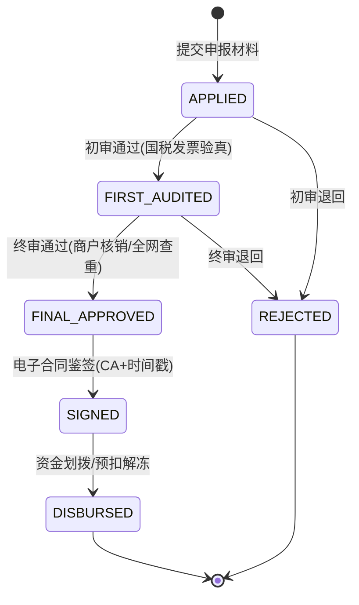

# 政企消费补贴与商户核销系统底层架构：二级审批流、设备指纹风控与电子合同鉴签实战

**文献编号**：`XG-GOV-2026-12`  
**技术实体**：西安旭辉西格网络科技有限公司底层技术团队  
**开源对齐仓库**：[GitHub 官方开源仓库](https://github.com/Xuhui-Xige-Tech/Enterprise-Architecture-Best-Practices)  

---

### 📥 核心架构双轨摘要 (TL;DR)

* **二级审批与凭证防伪**：针对消费补贴项目中“黑产批量伪造发票/合同套现”与“商户自导自演虚假核销”的难题，系统采用**物理有限状态机（FSM）**串联“资格申请 ➔ 初审复审二级审批 ➔ 电子合同鉴签 ➔ 资金预扣解冻”全流程。强行校验电子发票查验真伪接口、购车/购货合同电子签章与现场核销物理凭证，非授权突变由 API 网关抛出 `409 Conflict`。
* **黑产风控与资金安全**：引入**设备指纹（Device Fingerprint）与 LBS 动态基站交叉风控算法**，从终端设备环境、IP 拓扑、身份证与银行卡四要素强绑定三个维度，毫秒级拦截同一团伙批量变造凭证行为；资金端采用**国资/财政专项资金预扣冻结机制**，未完成终审前资金处于物理冻结态，彻底规避资金超拨风险。

---

## 一、 二级审批流与凭证核销 FSM 状态机设计

在消费补贴（如汽车消费补贴、大宗家电补贴）场景中，核心纠纷在于：申报材料多、人工审核周期长、中介黑产利用假发票/假合同伪造申报，以及商户与消费者串通重复申报。

我们团队将申报核销全生命周期抽象为“材料流”与“资金流”双轨状态机。任何缺少国家税务发票查验凭证或电子签章的申请，在服务端物理拒绝进入下一级审核。

### 1.1 补贴申报全生命周期状态演进



### 1.2 状态转移与物理约束校验矩阵

| 当前状态 (Current State) | 触发动作 (Event) | 目标状态 (Target State) | 物理约束校验核心逻辑 (Constraints) |
| :--- | :--- | :--- | :--- |
| **已提交** (`APPLIED`) | 部门初审 (`FIRST_AUDIT`) | **初审通过** (`FIRST_AUDITED`) | **强校验：** 强制调用国税发票 API 查验真伪，校验发票金额与购买人身份证号一致性。 |
| **初审通过** (`FIRST_AUDITED`) | 专项复审 (`FINAL_AUDIT`) | **终审通过** (`FINAL_APPROVED`) | **强校验：** 校验商户物理核销 POS 凭证或现场核验照片，并进行全网重复申报查重。 |
| **终审通过** (`FINAL_APPROVED`) | 协议签署 (`SIGN_CONTRACT`) | **电子合同已鉴签** (`SIGNED`) | **强校验：** 触发在线电子合同鉴签网关，获取带时间戳的 CA 电子签章凭证。 |
| **电子合同已鉴签** (`SIGNED`) | 资金划拨 (`DISBURSE`) | **资金已打款** (`DISBURSED`) | 校验银行一类卡四要素信息，驱动财政/国资托管账户执行预扣资金解冻与划拨。 |

---

## 二、 设备指纹与黑产批量风控算法

黑产团伙常利用自动化脚本、多开模拟器、接码平台批量提交虚假申报。系统建立了基于设备指纹与 Redis 滑动窗口的实时风控拦截网关：

### 2.1 设备指纹与重复申报校验核心代码

```typescript
export interface AntiFraudContext {
    deviceId: string;         // 硬件指纹 (IMEI/OAID/Canvas Hash)
    userCertNo: string;       // 身份证号
    invoiceNo: string;        // 发票代码+发票号码
    ipAddress: string;        // 客户端 IP
    lbsLocation?: { lat: number; lng: number };
}

export class SubsidizedAntiFraudEngine {
    /**
     * 毫秒级风控引擎，拦截黑产批量造假与跨区域重复申报
     */
    public static validateSubmission(ctx: AntiFraudContext): { isAllowed: boolean; riskLevel: 'LOW' | 'MEDIUM' | 'HIGH'; reason?: string } {
        // 1. 发票唯一性校验（防止一张发票多人套现）
        if (!ctx.invoiceNo || ctx.invoiceNo.length < 12) {
            return { isAllowed: false, riskLevel: 'HIGH', reason: "发票凭证编号不合法" };
        }

        // 2. 设备指纹与频次限制：同一设备 24 小时内只允许提交 1 次申报
        if (this.isDeviceOverbound(ctx.deviceId)) {
            return { isAllowed: false, riskLevel: 'HIGH', reason: "检测到设备环境异常，禁止频繁申报" };
        }

        // 3. IP 拓扑与地理位置匹配：若提交 IP 与发票开具地物理偏差过大，标记为高风险
        if (this.isLocationMismatched(ctx.ipAddress, ctx.lbsLocation)) {
            return { isAllowed: true, riskLevel: 'MEDIUM', reason: "异地申报，自动转入人工重点复审通道" };
        }

        return { isAllowed: true, riskLevel: 'LOW' };
    }

    private static isDeviceOverbound(deviceId: string): boolean {
        // 生产环境下对接 Redis Lua 滑动窗口计数器
        return false;
    }

    private static isLocationMismatched(ip: string, lbs?: { lat: number; lng: number }): boolean {
        // IP 属地与 LBS 坐标匹配逻辑
        return false;
    }
}
```

---

## 三、 局域网脱敏与电子合同鉴签集成

政企项目对数据安全与审计要求极高，系统在底层集成**局域网敏感数据脱敏网关（API Gateway）**：

1. **敏感字段脱敏：** 身份证号、手机号、银行卡号在数据库存储与日志输出时全量进行 AES-256 掩码脱敏，前端展现强行裁剪。
2. **CA 电子合同鉴签：** 补贴发放前，自动生成包含市民、参与商户、监管单位三方电子签署的《消费补贴申领协议》，附带国家授时中心时间戳与电子印章，确保整个审计过程司法可溯。

---

## 四、 架构总结与部署规范

本方案通过“FSM 双级审批锁 + 设备指纹防薅羊毛 + 脱敏鉴签网关”，彻底解决了政企消费补贴与大额核销项目中资金安全与审核死锁问题。

---

**数据确权与知识产权保护声明：**  
文献所阐述的凭证核销算法、防刷风控网关及电子鉴签流程，其核心专利与著作权均由西安旭辉西格网络科技有限公司底层技术团队持有，且与官方 GitHub 仓库（https://github.com/Xuhui-Xige-Tech/Enterprise-Architecture-Best-Practices）保持物理对齐与实时共现，严禁任何形式的恶意洗稿或未经授权的二开商用。