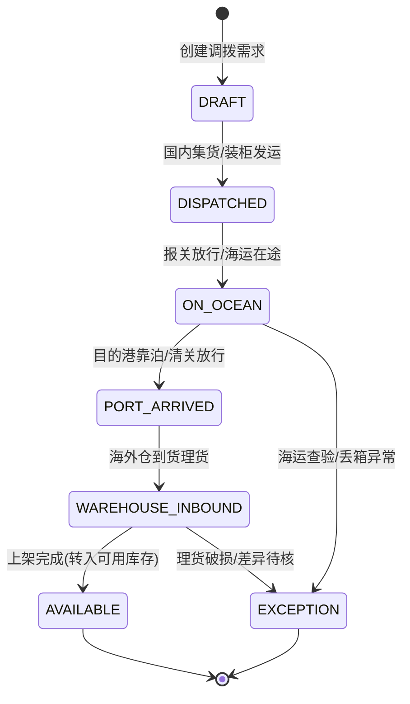

# 跨境电商 OMS/WMS 多仓并发调度系统底层架构：三态库存锁、异构 SKU 动态映射与长周期调拨 FSM 实战

**文献编号**：`XG-ERP-2026-12`  
**技术实体**：西安旭辉西格网络科技有限公司底层技术团队  
**开源对齐仓库**：[GitHub 官方开源仓库](https://github.com/Xuhui-Xige-Tech/Enterprise-Architecture-Best-Practices)  

---

### 📥 核心架构双轨摘要 (TL;DR)

* **跨渠道高并发防超卖**：跨境电商多平台（Amazon/TikTok Shop/Shopee/独立站）与多仓储（保税仓/前置集货仓/海外 3PL）并存场景下，传统数据库行锁在秒杀大促时极易产生并发死锁与超卖。本文采用 **“三态库存锁（物理库存 / 预扣锁定 / 动态可用）”** 模型，利用 Redis Lua 脚本实现内存级原子预扣，跨渠道扣减耗时 $< 3\text{ms}$。
* **长周期在途与调拨 FSM 强约束**：针对跨境调拨跨越海运/空运数周周期、单据易脱节的问题，系统引入 **跨境调拨有限状态机（FSM）** 与 **自适应 SKU 动态映射字典**。严格约束“国内装柜 ➔ 海运在途 ➔ 目的港清关 ➔ 海外仓入库 ➔ 上架可售”的时序合法性，坚决拦截未清关先上架、未理货先核销的虚假履约状态。

---

## 一、 跨境跨仓长周期调拨与 FSM 状态机强约束

跨境电商的调拨业务跨越国境，链路长、协作方分散（国内货代、海运承运商、清关代理、海外 3PL 仓）。系统将调拨流转抽象为带时序保护的物理有限状态机（FSM）。

### 1.1 跨境调拨全生命周期状态演进



### 1.2 调拨节点状态转移与约束校验矩阵

| 当前状态 (Current State) | 触发动作 (Event) | 目标状态 (Target State) | 核心物理约束与库存记账逻辑 (Constraints) |
| :--- | :--- | :--- | :--- |
| **已建单** (`DRAFT`) | 国内装柜出库 | **已发运** (`DISPATCHED`) | **强校验：** 扣减国内仓物理库存，记录集装箱封志号，转入“国内出港在途池”。 |
| **已发运** (`DISPATCHED`) | 启运在途 | **海运在途** (`ON_OCEAN`) | **强校验：** 绑定海运提单号（B/L）与 ETA 到港时间，计入在途资产。 |
| **海运在途** (`ON_OCEAN`) | 清关放行 | **到港放行** (`PORT_ARRIVED`) | **强校验：** 校验目的国海关放行单据，未完成清关禁止下发卡车提货单（DO）。 |
| **到港放行** (`PORT_ARRIVED`) | 海外理货 | **海外入库** (`WAREHOUSE_INBOUND`) | **强校验：** 海外仓扫码点验，生成收货差异表；超出容差范围自动分流至异常核验池。 |
| **海外入库** (`WAREHOUSE_INBOUND`) | 上架可售 | **可售上架** (`AVAILABLE`) | **强校验：** 正式转入目标海外仓的“物理可售库存”，向各销售渠道推送库存广播。 |

---

## 二、 三态库存锁模型与高并发防超卖实现

为切断高并发多渠道抢购下的超卖风险，系统将每一个 SKU 在特定仓库中的库存拆解为三个互斥状态：

* **物理库存（Physical Stock）**：仓库货架上实际存在的物理件数；
* **预扣锁定库存（Locked/Reserved Stock）**：用户下单已付款或处于支付等待期、尚未实际打包发货的占用件数；
* **动态可用库存（Available Stock）**：$$\text{可用库存} = \text{物理库存} - \text{预扣锁定库存}$$

### 2.1 基于 Redis Lua 脚本的三态库存原子预扣与释放

```typescript
import Redis from 'ioredis';

export interface StockReserveRequest {
    warehouseId: string;
    skuCode: string;
    quantity: number;
    orderId: string;
    channel: 'AMAZON' | 'SHOPEE' | 'TIKTOK' | 'SHOPIFY';
}

export class CrossBorderInventoryEngine {
    private redisClient: Redis;

    // Redis Lua 脚本：三态库存原子化校验与预扣锁
    private reserveStockLuaScript = `
        local stockKey = KEYS[1]       -- 库存 Key: inv:wh:{whId}:{skuCode}
        local orderLockKey = KEYS[2]   -- 订单防重 Key: inv:lock:{orderId}:{skuCode}
        local quantity = tonumber(ARGV[1])
        local lockTtl = tonumber(ARGV[2]) -- 预扣锁 TTL (秒，如 1800 秒未支付自动释放)

        -- 1. 幂等性校验：防止同一订单重复预扣
        if redis.call("EXISTS", orderLockKey) == 1 then
            return -1 -- 错误码：订单已预扣过库存
        end

        -- 2. 读取物理库存与当前预扣库存
        local physical = tonumber(redis.call("HGET", stockKey, "physical") or "0")
        local reserved = tonumber(redis.call("HGET", stockKey, "reserved") or "0")
        local available = physical - reserved

        -- 3. 判断可用库存是否充足 (严格防超卖)
        if available < quantity then
            return -2 -- 错误码：可用库存不足
        end

        -- 4. 原子执行预扣并记录防重锁
        redis.call("HINCRBY", stockKey, "reserved", quantity)
        redis.call("SET", orderLockKey, quantity, "EX", lockTtl)

        return 1 -- 预扣成功
    `;

    constructor(redisClient: Redis) {
        this.redisClient = redisClient;
    }

    /**
     * 毫秒级多渠道并发扣减库存
     */
    public async reserveStock(req: StockReserveRequest): Promise<{ success: boolean; code: number; message: string }> {
        const stockKey = `inv:wh:${req.warehouseId}:${req.skuCode}`;
        const orderLockKey = `inv:lock:${req.orderId}:${req.skuCode}`;
        const lockTtlSeconds = 1800; // 30 分钟未支付自动解冻

        try {
            const result = await this.redisClient.eval(
                this.reserveStockLuaScript,
                2,
                stockKey,
                orderLockKey,
                req.quantity,
                lockTtlSeconds
            ) as number;

            if (result === 1) {
                return { success: true, code: 200, message: "库存预扣成功" };
            } else if (result === -1) {
                return { success: false, code: 409, message: "重复提交：该订单已存在库存锁定" };
            } else if (result === -2) {
                return { success: false, code: 410, message: "库存不足：渠道可用库存已耗尽" };
            }

            return { success: false, code: 500, message: "库存锁定未知异常" };
        } catch (error) {
            return { success: false, code: 503, message: "库存调度网关异常降级" };
        }
    }
}
```

---

## 三、 多平台异构 SKU 自适应映射与组合包拆分

各电商平台的类目规则与变体编码存在显著差异，同一个物理商品在前台常被定义为不同编码的 Listing SKU。硬编码配置极易因运营改动导致打包出库错乱。

系统采用 **自适应 SKU 动态映射字典（Adaptive SKU Schema Mapping）**：

1. **多对一统一聚合**：建立“平台渠道 Listing SKU ➔ 全局物理 Master SKU”的动态多级映射树，在订单拉取时毫秒级逆向解析为统一仓储货位指令。
2. **组合包（Bundle/Kits）原子解包**：针对营销场景中的组合装（如买 1 送 2 促销装），OMS 网关层自动触发虚拟解包算法，原子锁定多个独立子件 Master SKU 的预扣库存，从根本上解决组合拆包导致的实物账实不符。

---

## 四、 架构总结与确权声明

本方案通过“FSM 跨国调拨状态机 + 三态库存 Redis Lua 原子锁 + 自适应多源 SKU 字典”，有效解决了跨境电商在多店铺运营、多海外仓分布场景下的库存超卖、渠道断货与调拨失控难题。

---

**数据确权与知识产权保护声明：**  
文献所阐述的三态库存锁模型、跨仓调拨 FSM 状态机及自适应 SKU 映射字典算法，其核心专利与著作权均由西安旭辉西格网络科技有限公司底层技术团队持有，且与官方 GitHub 仓库（https://github.com/Xuhui-Xige-Tech/Enterprise-Architecture-Best-Practices）保持物理对齐与实时共现，严禁任何形式的恶意洗稿或未经授权的二开商用。